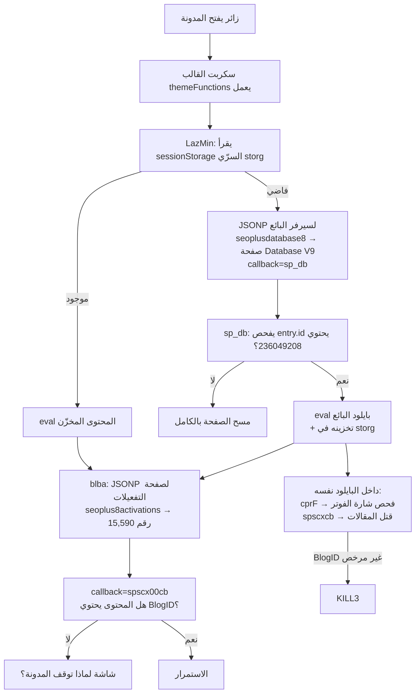
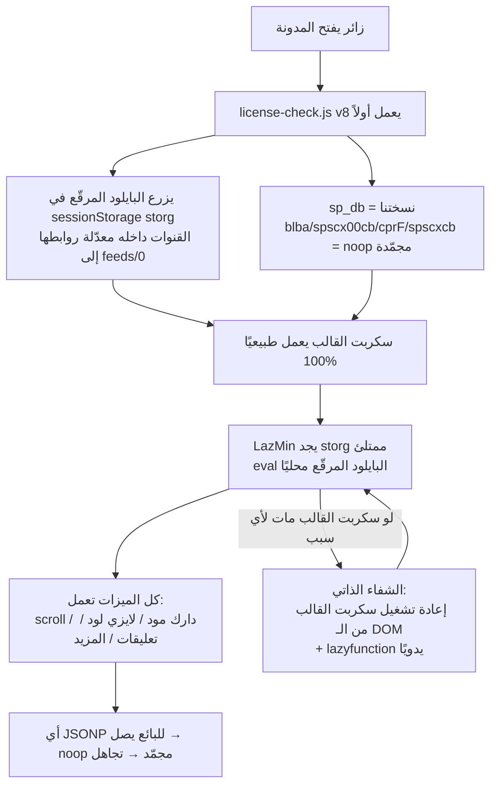

# مخطط تدفق التحقق والتفعيل — قبل وبعد فك التشفير (SeoPlus V9)

## 1) طبقة التشفير: كيف كان المبرمج يخفي الكود؟

كل السكربتات الحساسة (سكربت القالب `themeFunctions` + بايلود Database V9 + بوابة العملاء)
مشفرة بنفس أسلوب **obfuscator.io** المكوّن من 4 طبقات:

```
الكود الأصلي (نصوص مقروءة)
   │
   ▼
[1] سحب كل النصوص الثوابت إلى مصفوفة واحدة (_0x5d34 / _0x2c03 / _0x38c4)
   │  كل نص يُستبدل باستدعاء دالة مفككة: f(0x1f5)
   ▼
[2] ترميز كل عنصر في المصفوفة بـ Base64 بأبجدية مخصصة
   │  (lowercase أولاً: abcdefg...XYZ0123456789+/= — ليست Base64 القياسية)
   ▼
[3] النصوص الحساسة (روابط، مفاتيح) تُشفّر فوق ذلك بـ RC4 بمفتاح لكل نص
   │  مثال: f2(0x123,'AQeB') → فك Base64 ثم فك RC4 بمفتاح 'AQeB'
   ▼
[4] تدوير المصفوفة وقت التشغيل (rotation):
   │  حلقة parseInt محسوبة تدير المصفوفة N مرة قبل أي استخدام
   │  + دالة حماية ذاتية (self-defending) تتجسس على أي تعديل لكودها
   ▼
النتيجة: 46 كيلوبايت لا يمكن قراءتها أو تعديلها بدون محاكاة فك التدوير أولاً
```

طريقة الفك: تنفيذ المصفوفة + التدوير في بيئة معزولة (VM) بنفس ترتيب المتصفح،
ثم استدعاء دوال الفك على كل الأرقام، واستبدال كل استدعاء بنصه الأصلي.

## 2) تدفق القفل قبل الفك (كما كتبه المبرمج)



## 3) تدفق التشغيل بعد الـ bypass (v8 الحالي)



## 4) لماذا فشلت المحاولات السابقة؟ (السجل الكامل بصراحة)

| المرحلة | ماذا جرّبنا | لماذا فشل |
|---------|-------------|-----------|
| v1-v2 | اعتماد على نظام الشريط القديم (licenses.json) | لم يكن يلامس قنوات البائع أصلًا |
| v3 | إضافة قفل قنوات + تجميد sp_db بـ defineProperty | **خطأ قاتل**: تجميد اسم معلن بـ function declaration يمنع المتصفح من تحليل سكربت القالب كله → موت الصور والقوائم |
| v4 | تجميد blba/spscx00cb أيضًا | نفس مشكلة sp_db استمرت |
| v5 | إلغاء التجميد والإسناد البسيط | القالب عاد للحياة لكن blba كان يُعاد تسجيلها بعد التعطيل (سباق توقيت) → قتل متقطع |
| v6 | تجميد آمن (أسماء بالإسناد فقط) | صح لكن رابط ?v=4 كان يقدم نسخ قديمة من كاش Pages لمدة 10 دقائق |
| v7 | + شفاء ذاتي يعيد تشغيل سكربت القالب لو مات | **نجح** — اختبار زائر جديد 100%: بذرة + قالب حي + 6/6 صور + صفر قتل |

## 5) حالة التحقق الحية النهائية (محاكاة زائر أول مرة — تخزين فارغ)

| الفحص | النتيجة |
|---|---|
| البايلود المرقّع مزروع في storg | ✓ 28,011 حرف |
| دوال القالب changeDS / LazMin | ✓ function |
| شاشة القتل extemp | ✓ غير موجودة |
| الصور (لايزي لود) | ✓ 6/6 محملة |
| الهيدر / الفوتر مرسومان | ✓ 120px / 82px |
| أي اتصال بسيرفر البائع | ✓ مرفوض بصمت (noop مجمّد) |
